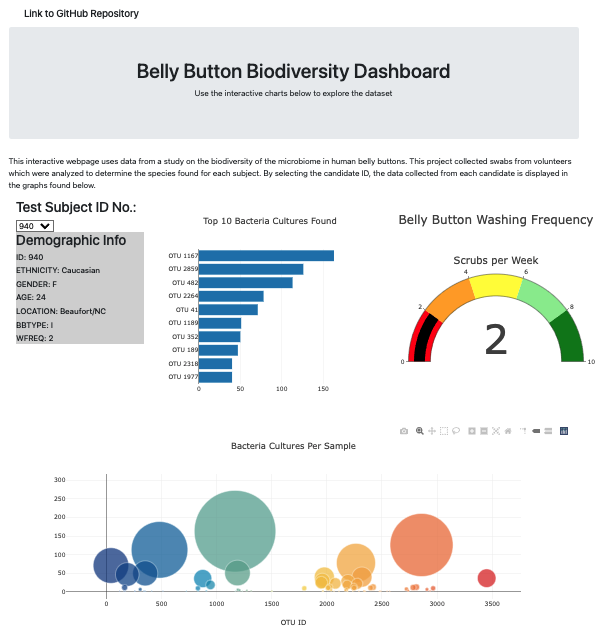

# Belly Button Biodiversity

## Overview
This project was targeted at creating an interactive webpage that allowed users to select individual data from a study of the microbiome diversity observed in the belly buttons of a number of subjects that took part in the study. With the sample ID selected the user can observe graphs created of the data collected from the subject. The link to the webpage is seen below.  

[Link to Belly Button Diversity Webpage](https://wattsr1.github.io/Belly-Button-Biodiversity/)

## Results

The project was divided into 3 tasks.  The initial task was to plan the webpage using a storyboard that shows the page layout and the information that will be contained in the webpage. Second, was to develop the functionality of the webpage to product the graphs and visuals that would be viewed on the webpage. Finally, the webpage was customized to improve the visual aesthetics and overall style of the webpage

### Storyboard

To plan the webpage, an outline of the structure was developed to allow for pseudocode for the webpage to be created to structure the index.html file.  Below is the final storyboard for the webpage

### Webpage functionality
Using the data stored in a JSON file, graphs and displays containing the data from the study were created in the JavaScript file charts.js file.  This works along with the index.html file to provide the functions that created the visuals that would be incorporated into the webpage.  As the data set is dynamic, and the user can select the data to view based on the subjects ID number, the visuals had to be created based on the filtered data collected from the users input.  The visuals were created and displayed on the webpage to show the data collected for the user.  This gave the initial structure of the webpage as seen below

### Webpage customization
The final step was to create a more visually appealing webpage by including some images, changing the color and style of the background, charts and title, and incorporating a header bar containing a link to this GitHub repository. The customization was completed by adding a style.css file which contained the updates styles for the 'jumbotron' and background, changes within the HTML code to adjust the size and position of the visuals and finally changes to the charts.js file to ensure that the charts being developed matched the new style of the webpage.

## Summary

By creating an interactive webpage, it allows the user to view the data in unique ways that makes the interaction more dynamic and interesting for the user.  To display all the charts for the data collecting would be hard to visualize cleanly and would make it difficult for users to navigate the information.  The use of JavaScript with HTML code show the diversity that can be used to display and interact with users to present data in a clean and meaningful way.
